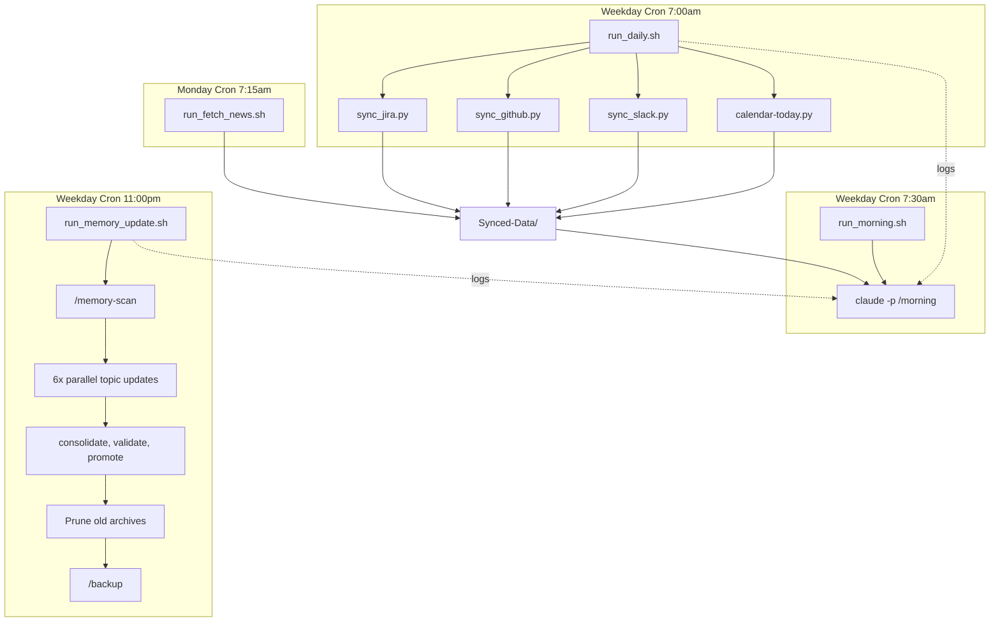

# AI Context System

**A personal knowledge management system powered by Claude Code and Claude Desktop.**

Process meeting transcripts, Slack threads, and documents into a structured, searchable memory — then use that context to prepare for meetings, write updates, track decisions, and never lose institutional knowledge again.

Ships with a fully functional **Star Wars demo persona** (Darth Vader, COO of the Death Star) so you can explore the system before plugging in your own context.

---

## Why This Exists

Every professional accumulates context — who said what in which meeting, why a decision was made, what a teammate is worried about, which project is at risk. Most of this context lives in your head, scattered across notes, or buried in Slack.

This system captures that context, structures it, and makes it available to an AI assistant that knows your world. It's the difference between a generic chatbot and an assistant that remembers your last six months of meetings.

### What It Does

- **Processes meetings** — Drop in a transcript, get structured insights with action items, decisions, and relationship dynamics
- **Tracks decisions** — Every decision recorded with context, rationale, and who was involved
- **Maintains relationships** — Knows your team, their communication styles, and what matters to them
- **Prepares you** — Morning briefings, meeting prep, and context surfacing before you need it
- **Builds over time** — The memory system grows with every interaction, getting more useful the longer you use it

---

## Quick Start

```bash
# Clone the repository
git clone https://github.com/YOUR_USERNAME/ai-context-system.git
cd ai-context-system

# Run setup (copies config, creates directories)
./setup.sh

# Explore with the Star Wars demo, or clear it and start fresh:
./setup.sh --clear

# Start using with Claude Code (or Claude Desktop)
# The system reads CLAUDE.md automatically
```

### Three Steps to Personalise

1. **Clear the demo data** — Run `./setup.sh --clear` to remove all Star Wars content, then `./setup.sh` to create a fresh `config.yaml`
2. **Edit `config.yaml`** — Replace the defaults with your real details
3. **Drop content into `Raw-Materials/`** and **run slash commands** — `/meeting`, `/slack`, `/doc` to process them

That's it. The system builds your personal knowledge graph from there.

### Optional: Set Up Automation

For hands-free daily operation, configure the data sync and cron pipeline:

1. Set up sync credentials: `cp Sync/.env.example Sync/.env` and add your Jira API token, Slack session token + cookie, and workspace URL
2. Configure channels and teams: `cp Sync/config.example.json Sync/config.json`
3. Install the cron schedule: edit paths in `Scripts/crontab.txt`, then `crontab Scripts/crontab.txt`

See `Sync/SETUP_GUIDE.md` for detailed instructions including Slack token extraction.

---

## Architecture

The system operates as an automated daily pipeline with manual processing commands for ad-hoc content:



1. **Data ingress** (automated daily): Jira issues, GitHub PRs, Slack channels, and calendar events are synced into `Synced-Data/` every weekday morning
2. **Morning journal** (automated daily): Claude CLI generates an enriched daily journal with agenda, context, and automation status reporting
3. **Content processing** (manual): Slash commands (`/meeting`, `/doc`, `/slack`) process raw materials from `Raw-Materials/` into structured markdown in `Curated-Context/`
4. **Memory updates** (automated nightly): The full 5-phase memory update cycle runs each weeknight, aggregating curated context into six thematic memory files
5. **News digest** (automated weekly): RSS feeds are fetched on Monday mornings; Claude generates a curated digest

### The Memory Pipeline

Information flows through three stages:

1. **Raw Materials** — Unprocessed inputs (transcripts, docs, Slack exports)
2. **Curated Context** — Structured knowledge extracted by slash commands (insights, people profiles, decision records)
3. **Memory** — Persistent, evolving system memory that grows over time

Each stage feeds the next. Memory files are never wiped — they're updated incrementally, so context accumulates rather than resets.

---

## Commands

### Information Processing
| Command | What It Does |
|---------|-------------|
| `/meeting` | Process a meeting transcript → structured insights, action items, decisions |
| `/meeting-analysis` | Deep-dive on communication patterns and dynamics |
| `/slack` | Process Slack threads → summaries and action items |
| `/doc` | Process any document into structured notes |
| `/news` | Generate a news digest from your RSS feeds |

### Daily Operations
| Command | What It Does |
|---------|-------------|
| `/morning` | Morning briefing — calendar, priorities, relevant context |
| `/delivery` | Generate a status/delivery update |
| `/prep` | Prepare context for an upcoming meeting |
| `/brag` | Update your achievement/impact document |
| `/interview` | Build interview preparation context |

### Memory Management
| Command | What It Does |
|---------|-------------|
| `/memory-scan` | Find new information to incorporate |
| `/memory-org` | Review and reorganise memory structure |
| `/memory-strategy` | Update processing strategies |
| `/memory-projects` | Track active projects |
| `/memory-decisions` | Record or review decisions |
| `/memory-team` | Update team dynamics |
| `/memory-relationships` | Update stakeholder/relationship map |
| `/memory-consolidate` | Compress and clean up memory |
| `/memory-validate` | Check memory consistency |
| `/memory-promote` | Move curated context → long-term memory |
| `/memory-update` | General memory refresh |

### Utilities
| Command | What It Does |
|---------|-------------|
| `/thought` | Capture a quick thought or observation |
| `/backup` | Backup memory and context |
| `/help` | Show commands and system overview |

---

## The Star Wars Demo

The system ships with a complete demo persona to explore before adding your own data:

**You are Darth Vader**, Chief Operating Officer of Death Star Operations. Your team includes:

| Character | Role | Personality |
|-----------|------|-------------|
| Grand Moff Tarkin | Station Commander / CEO | Calculating, politically astute |
| Admiral Piett | VP Naval Operations | Nervous, eager to please |
| General Veers | Director of Ground Forces | Competent, straight-talking |
| Moff Jerjerrod | Engineering Lead | Perpetually behind schedule |
| Captain Needa | Senior Fleet Captain | Apologetic about failures |
| Emperor Palpatine | CEO / Supreme Leader | Demanding, does not tolerate failure |

Sample data includes meeting transcripts, decision records, Slack summaries, and memory files — all written in-universe with just enough corporate authenticity to be both useful and entertaining.

When you're ready to use the system with your own data, run:

```bash
./setup.sh --clear
```

This removes all demo content (Memory, Curated-Context, Raw-Materials, Synced-Data, Archive, and `config.yaml`) while preserving the system files (Guidelines, Prompts, Scripts, slash commands, and Templates). You'll be prompted to confirm before anything is deleted.

---

## Obsidian Integration

The entire project directory works as an [Obsidian](https://obsidian.md) vault. Open it in Obsidian and you get:

- **Graph View** — Visual map of connections between people, projects, meetings, and decisions
- **Wikilinks** — All processed content includes `[[cross references]]` that Obsidian turns into clickable links
- **Search** — Full-text search across your entire knowledge base
- **Daily Notes** — Mapped to `Curated-Context/Daily-Journals/`

### Recommended Obsidian Settings

| Setting | Value |
|---------|-------|
| Default note location | `Curated-Context/` |
| Templates folder | `Curated-Context/Obsidian-Specific-Dirs/Templates/` |
| Daily notes folder | `Curated-Context/Daily-Journals/` |
| Daily notes format | `YYYY-MM-DD` |

---

## Project Structure

```
.
├── config.yaml                 # Your configuration (gitignored)
├── config.example.yaml         # Star Wars demo config
├── CLAUDE.md                   # System instructions for Claude
├── Raw-Materials/              # Unprocessed inputs
│   ├── Meeting-Transcripts/
│   ├── Docs/
│   └── Slack/
├── Curated-Context/            # Processed knowledge
│   ├── Daily-Journals/
│   ├── People/
│   ├── Project-Insights/
│   ├── Team-Knowledge/
│   └── ... (14 categories)
├── Memory/                     # Long-term system memory
├── Synced-Data/                # Jira, GitHub, Slack, Calendar, RSS data
├── .claude/commands/           # 24 slash commands
├── Guidelines/                 # Processing guidelines
├── Scripts/                    # Utility scripts
│   ├── run_morning.sh          # Cron: automated /morning via Claude CLI
│   ├── run_memory_update.sh    # Cron: nightly memory update via Claude CLI
│   ├── crontab.txt             # Reference crontab with all scheduled jobs
│   └── News/                   # RSS feed aggregation
├── Sync/                       # Data sync tools (Jira, GitHub, Slack)
│   ├── sync_jira.py            # Jira hierarchy sync
│   ├── sync_github.py          # GitHub PR activity sync
│   ├── sync_slack.py           # Slack channel sync via session token
│   └── run_daily.sh            # Cron: daily data ingress orchestration
└── Archive/                    # Archived content
```

---

## Configuration

All personalisation lives in `config.yaml`. The system reads it at runtime — no template substitution, no code generation. Claude naturally reads files for context, so we lean into that.

See `config.example.yaml` for the full schema with the Star Wars demo values.

Key sections:
- **user** — Your name, role, email, timezone
- **company** — Organisation name, Jira/Confluence URLs
- **team** — Your team members with roles and relationship notes
- **stakeholders** — Key people outside your direct team
- **communication_style** — Spelling, formality, tone preferences
- **obsidian** — Vault settings

---

## Data Sync (Jira, GitHub & Slack)

The `Sync/` directory contains scripts that pull external data into `Synced-Data/` for analysis by the `/delivery` command and other workflows.

### Available Syncs

| Sync | What It Does | Auth Required |
|------|-------------|---------------|
| **Jira** | Fetches issue hierarchies under configurable root issues | Jira API token |
| **GitHub** | Fetches merged PRs authored by your team members | GitHub Personal Access Token |
| **Slack** | Fetches channel messages with threads and user resolution | Slack session token + `d` cookie |

### Setup

```bash
cd Sync
python3 -m venv .venv
source .venv/bin/activate
pip install requests python-dotenv pyyaml

cp .env.example .env          # Add your API tokens and Slack credentials
cp config.example.json config.json  # Configure your org, teams, channels, and root issues
```

### GitHub Sync Configuration

The GitHub sync reads team membership from `Curated-Context/Teams/` stubs and resolves GitHub handles from `Curated-Context/People/` front-matter. To use it:

1. Set `github.org` and `github.teams` in `Sync/config.json`
2. Add a `GITHUB_TOKEN` to `Sync/.env` (PAT with `repo` scope)
3. Add a `github: username` field to each team member's People stub YAML front-matter

### Slack Sync Configuration

The Slack sync uses your session token to fetch messages from configured channels. To set it up:

1. Extract your session token and `d` cookie from the browser (see `Sync/SETUP_GUIDE.md`)
2. Add `SLACK_SESSION_TOKEN`, `SLACK_COOKIE_D`, and `SLACK_WORKSPACE_URL` to `Sync/.env`
3. Configure channels in `Sync/config.json` under `slack.channels`

### Automation

All syncs are orchestrated by `Sync/run_daily.sh`, which runs each weekday morning via cron:

| Schedule | Script | Purpose |
|----------|--------|---------|
| Weekdays 7:00am | `Sync/run_daily.sh` | Data ingress: Jira, GitHub, Slack, Calendar |
| Weekdays 7:30am | `Scripts/run_morning.sh` | Morning journal via Claude CLI |
| Monday 7:15am | `Scripts/News/run_fetch_news.sh` | RSS news fetch |
| Weekdays 11:00pm | `Scripts/run_memory_update.sh` | Full memory update cycle via Claude CLI |

Install with `crontab Scripts/crontab.txt` (edit paths first).

See `Sync/README.md` for full details, CLI options, and troubleshooting.

---

## Privacy & Security

This system is designed to hold **sensitive professional context**. Treat it accordingly:

- `config.yaml` is **gitignored** — your personal data never leaves your machine
- Raw materials and memory files contain real professional context — keep your repo **private** if you're using it with real data
- **Never commit real names, emails, or company details to a public repository**

---

## Contributing

Contributions welcome! See [CONTRIBUTING.md](CONTRIBUTING.md) for guidelines.

Areas where help is particularly appreciated:
- New slash commands for common workflows
- Improved processing guidelines
- Better Obsidian integration
- Additional sync connectors (Google Calendar, Linear, Notion)
- Memory consolidation algorithms

---

## Licence

MIT — see [LICENSE](LICENSE) for details.
